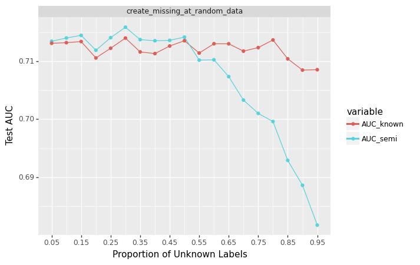
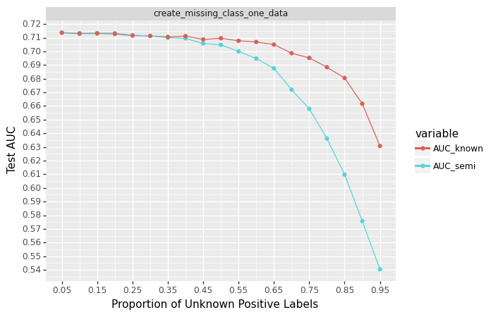

## Repo Overview

For all supervised machine learning projects, computing an accurate
label is critical. It is fairly common to have bespoke data feeds for
each client. This can cause an inability to create labels for some
clients. Semi-supervised machine learning is a path forward when the
predictor variables can be created across many clients but the response
variable is only computable for a subset.

In this repo, I test scikit-learn’s semi-supervised method
SelfTrainingClassifier by asking

- Does the semi-supervised model perform better than only using the
  known labels?
- How does AUC change as the proportion of unknown labels increases?
- Does how the label is missing affect the method? Random vs systematic.

## Simulation Setup

Basic outline:

- Step 1: Create data.
- Step 2: Train a model using a semi-supervised method. Compute test
  AUC.
- Step 3: Train a model only using the known labels. Compute test AUC.

For each iteration, only fifty thousand data points are created (labeled
and unlabeled). This process is repeated varying the proportion of data
with unknown labels. Each combination of settings is repeated 10 times
and an average is computed to reduce variability.

The first few iteration look like

                      missingPattern  prop  b  AUC_semi  AUC_known
    0  create_missing_at_random_data  0.05  0  0.717926   0.717263
    1  create_missing_at_random_data  0.05  1  0.713586   0.713450
    2  create_missing_at_random_data  0.05  2  0.714024   0.713825
    3  create_missing_at_random_data  0.05  3  0.712036   0.711454
    4  create_missing_at_random_data  0.05  4  0.709113   0.709084

## Results

For this simulation, labels are missing at random. Semi-supervised
methods helped a bit when 50% or less of the labels are missing. For
more than 50%, it is better to only use known labels.

    <ggplot: (130234511854)>

For this simulation, only positive class’s labels are missing at random.
The negative label is always known. This time the semi-supervised method
never helped. Sometimes it hurt performance.

    <ggplot: (130235044846)>

SelfTrainingClassifier is not a silver bullet. Relative to only using
known labels, its performance depends on how the labels are missing
(random vs systematic) and how much of the data is missing a label.
